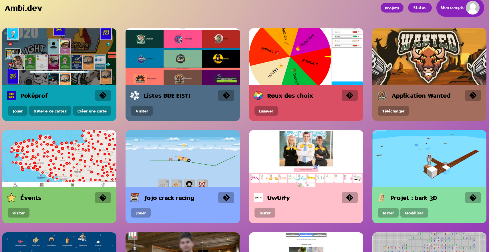

# Site web

Site web regroupant mes différents projets.

Actuellement déployé sur [ambi.dev](https://ambi.dev).




## Lancer en local

### Avec Docker

 - cloner le projet avec git
 - créer un fichier sitemap.json à la racine du projet en prenant exemple sur [sitemap.json.example](sitemap.json.example) ou à un autre emplacement en spécifiant le chemin dans la variable d'environnement `SITEMAP_PATH`
 - optionnel : mettre les variables d'environnement `HCAPTCHA_SECRET`, `HCAPTCHA_SITEKEY` et `MAIL_HOST` dans un fichier `.env` à la racine du projet
 - lancer les conteneurs docker avec `docker compose up -d`


### Sans Docker

Il est possible de lancer le projet en local.
Pour cela il faut faudra PHP et MySQL.
 - cloner le projet avec git
 - créer un utilisateur et une base de données MySQL
 - créer un fichier src/api/credentials.php contenant identifiants de la base de données, sous cette forme :
```php
<?php
define('DB_HOST', 'my_host');
define('DB_USER', 'my_user');
define('DB_PASS', 'my_password');
define('DB_NAME', 'my_dbname');
// les lignes suivantes sont optionnelles
define('SITE_NAME', 'Ambi.dev');
define('SITE_DESCRIPTION', 'Site web regroupant mes différents projets.');
define('SITE_KEYWORDS', 'ambi, dev, site, web, projets');
define('SITE_AUTHOR', 'Ambi');
define('HCAPTCHA_SECRET', '0x123456789aBcDeF');
define('HCAPTCHA_SITEKEY', '0123abcd-45ef-6789-abcd-ef0123456789');
?>
```
 - créer un fichier src/sitemap.json en prenant exemple sur [sitemap.json.example](sitemap.json.example)
 - exécuter dans la base de données le script SQL [database/init.sql](database/init.sql)
 - optionnel mais nécessaire pour envoyer les mails de récupération, installer un serveur SMTP local (port 25)
 - lancer le serveur php


## Dépendances

- [PHP 8](https://www.php.net/)
  - [MySQLi](https://www.php.net/manual/en/book.mysqli.php)
- [MySQL 8](https://www.mysql.com/) ou [MariaDB 10](https://mariadb.org/)