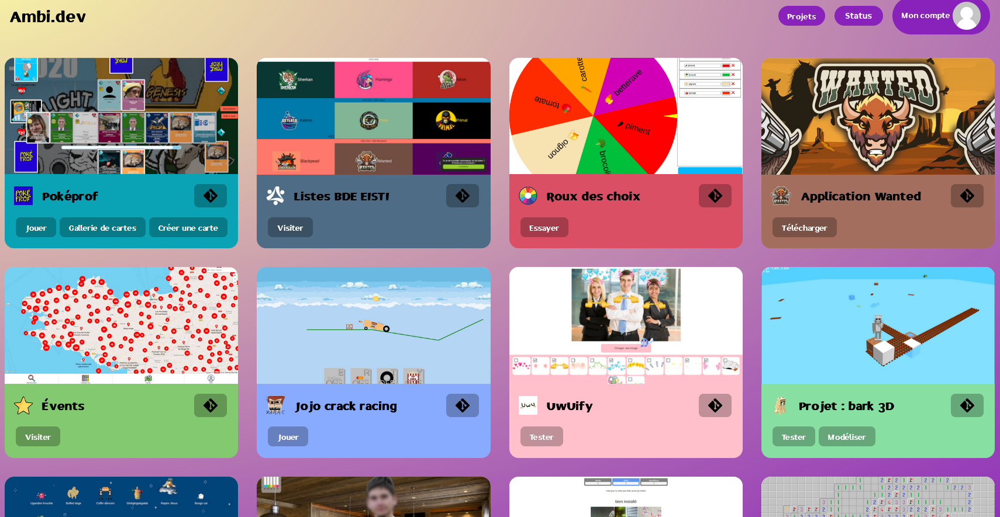

# Site web

Site web regroupant mes différents projets.

Actuellement déployé sur [ambi.dev](https://ambi.dev).




## Lancer en local

### Avec Docker

 - cloner le projet avec git
 - créer un fichier sitemap.json à la racine du projet en prenant exemple sur [sitemap.json.example](sitemap.json.example) ou à un autre emplacement en spécifiant le chemin dans la variable d'environnement `SITEMAP_PATH`
 - optionnel : mettre les variables d'environnement `AUTH_URL`, `SITEMAP_PATH`, `SITE_NAME`, `SITE_DESCRIPTION`, `SITE_KEYWORDS` et `SITE_AUTHOR` dans un fichier `.env` à la racine du projet
 - lancer les conteneurs docker avec `docker compose up -d`


### Sans Docker

Il est possible de lancer le projet en local.
Pour cela il faut faudra PHP et MySQL.
 - cloner le projet avec git
 - optionnel: créer un fichier src/api/config.php contenant la configuration, sous cette forme :
```php
<?php
define('AUTH_URL', 'http://auth.ambi.dev');
define('SITE_NAME', 'Ambi.dev');
define('SITE_DESCRIPTION', 'Site web regroupant mes différents projets.');
define('SITE_KEYWORDS', 'ambi, dev, site, web, projets');
define('SITE_AUTHOR', 'Ambi');
?>
```


## Dépendance

- [PHP 8](https://www.php.net/)