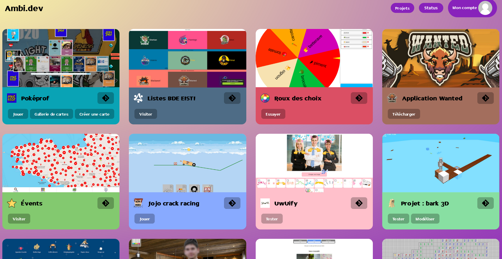

# Site web

Site web regroupant mes différents projets.

Actuellement déployé sur [ambi.dev](https://ambi.dev).




## Lancer en local

### Avec Docker

 - cloner le projet avec git
 - créer un fichier `sitemap.json` à la racine du projet en prenant exemple sur [sitemap.json.example](sitemap.json.example), ou définir un autre chemin avec la variable d'environnement `SITEMAP_PATH`
 - optionnel : mettre les variables d'environnement `AUTH_URL` et `SITEMAP_PATH` dans un fichier `.env` à la racine du projet
 - lancer les conteneurs docker avec `docker compose up -d`


### Sans Docker

Il est possible de lancer le projet en local.
Pour cela il faut faudra PHP.
 - cloner le projet avec git
 - optionnel: créer un fichier src/api/config.php contenant la configuration, sous cette forme :
```php
<?php
define('AUTH_URL', 'http://auth.ambi.dev');
?>
```


## Dépendance

- [PHP 8](https://www.php.net/)
